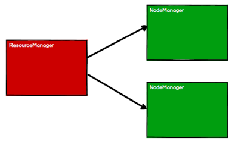
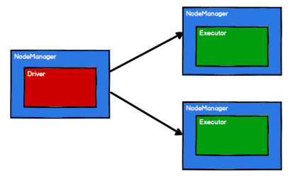
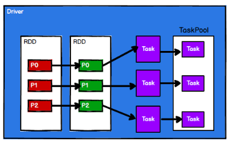
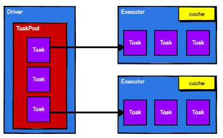

# spark3.0
这是一个自学课程，视频地址：https://www.bilibili.com/video/BV11A411L7CK?from=search&seid=9755988563865343821&spm_id_from=333.337.0.0
<hr>

## 一、快速上手
### 1. 创建Maven项目
#### 1.1 增加Scala插件
Spark由Scala语言开发的，所以接下来的开发所使用的语言也为Scala，默认采用的Scala编译版本为2.12。开发前请保证IDEA开发工具中含有Scala开发插件。

在IDEA中找到setting -> Plugins，下载Scala。


#### 1.2 增加pom依赖
```xml
<dependencies>
    <dependency>
        <groupId>org.apache.spark</groupId>
        <artifactId>spark-core_2.12</artifactId>
        <version>3.0.0</version>
    </dependency>
</dependencies>
<build>
    <plugins>
        <!-- 该插件用于将Scala代码编译成class文件 -->
        <plugin>
            <groupId>net.alchim31.maven</groupId>
            <artifactId>scala-maven-plugin</artifactId>
            <version>3.2.2</version>
            <executions>
                <execution>
                    <!-- 声明绑定到maven的compile阶段 -->
                    <goals>
                        <goal>testCompile</goal>
                    </goals>
                </execution>
            </executions>
        </plugin>
        <plugin>
            <groupId>org.apache.maven.plugins</groupId>
            <artifactId>maven-assembly-plugin</artifactId>
            <version>3.0.0</version>
            <configuration>
                <descriptorRefs>
                    <descriptorRef>jar-with-dependencies</descriptorRef>
                </descriptorRefs>
            </configuration>
            <executions>
                <execution>
                    <id>make-assembly</id>
                    <phase>package</phase>
                    <goals>
                        <goal>single</goal>
                    </goals>
                </execution>
            </executions>
        </plugin>
    </plugins>
</build>
```

#### 1.3 运行第一个Spark程序
在执行程序之前，你需要：
1. 在根目录下创建input文件夹，创建 words.txt 文本文件，并写入一些单词，单词与单词之间使用空格隔开；
2. 为了防止程序报错，你应该在windows环境提前准备好winutils.exe文件，并提前设置好HADOOP_HOME环境变量；
3. 为了更好能看到结果，最好将日志级别设置为ERROR；[设置日志级别](https://github.com/Erosennines/spark3.0/blob/master/src/main/resources/log4j.properties)

以上步骤准备好后，就可以尝试编写第一个Spark代码：[wordcount](https://github.com/Erosennines/spark3.0/blob/master/src/main/java/com/spark/day01/Day01_01_WordCount.scala)

## 二、Spark运行环境
### 1. local模式
所谓的Local模式，就是不需要其他任何节点资源就可以在本地执行Spark代码的环境，一般用于教学，调试，演示等，之前在IDEA中运行代码的环境我们称之为开发环境，不太一样。

### 2. standalone模式
local本地模式毕竟只是用来进行练习演示的，真实工作中还是要将应用提交到对应的集群中去执行，所谓独立部署是指只使用Spark自身节点运行的集群模式，不论是资源调度还是执行调度都由Spark自身完成，不依赖第三方组件。Spark的Standalone模式体现了经典的master-slave模式。

### 3. Yarn模式（主要）
独立部署（Standalone）模式由Spark自身提供计算资源，无需其他框架提供资源。这种方式降低了和其他第三方资源框架的耦合性，独立性非常强。但是，Spark主要是计算框架，而不是资源调度框架，所以本身提供的资源调度并不是它的强项，所以还是和其他专业的资源调度框架集成会更靠谱一些。（主要是因为在国内的工作中，Yarn使用的非常多）。

### 4. K8S & Mesos模式
Mesos是Apache下的开源分布式资源管理框架，它被称为是分布式系统的内核,在Twitter得到广泛使用,管理着Twitter超过30,0000台服务器上的应用部署，但是在国内，依然使用着传统的Hadoop大数据框架，所以国内使用Mesos框架的并不多，但是原理其实都差不多。

### 5. 常用端口号介绍
Spark查看当前Spark-shell运行任务情况端口号：4040（计算）;<br>
Spark Master内部通信服务端口号：7077；<br>
Standalone模式下，Spark Master Web端口号：8080（资源）；<br>
Spark历史服务器端口号：18080；<br>
Hadoop YARN任务运行情况查看端口号：8088

## 三、Spark核心编程
Spark计算框架为了能够进行高并发和高吞吐的数据处理，封装了三大数据结构，用于处理不同的应用场景。三大数据结构分别是：
- RDD: 弹性分布式数据集
- 累加器：分布式共享只写变量
- 广播变量：分布式共享只读变量

接下来我们一起看看这三大数据结构是如何在数据处理中使用的。

### 1. RDD
#### 1.1 什么是RDD
RDD（Resilient Distributed Dataset）叫做弹性分布式数据集，是Spark中最基本的数据处理模型。代码中是一个抽象类，它代表一个弹性的、不可变、可分区、里面的元素可并行计算的集合。
- 弹性
  - 存储的弹性：内存与磁盘的自动切换；<br>
  - 容错的弹性：数据丢失可以自动恢复；<br>
  - 计算的弹性：计算出错重试机制；<br>
  - 分片的弹性：可根据需要重新分片。<br>
- 分布式：数据存储在大数据集群不同节点上
- 数据集：RDD封装了计算逻辑，并不保存数据
- 数据抽象：RDD是一个抽象类，需要子类具体实现
- 不可变：RDD封装了计算逻辑，是不可以改变的，想要改变，只能产生新的RDD，在新的RDD里面封装计算逻辑
- 可分区、并行计算

#### 1.2 RDD的核心属性
- 分区列表<br>
  > RDD数据结构中存在分区列表，用于执行任务时并行计算，是实现分布式计算的重要属性。
- 分区计算函数<br>
  > Spark在计算时，是使用分区函数对每一个分区进行计算
- RDD之间的依赖关系<br>
  > RDD是计算模型的封装，当需求中需要将多个计算模型进行组合时，就需要将多个RDD建立依赖关系
- 分区器（可选）<br>
  > 当数据为KV类型数据时，可以通过设定分区器自定义数据的分区
- 首选位置（可选）<br>
  > 计算数据时，可以根据计算节点的状态选择不同的节点位置进行计算

#### 1.3 执行原理
从计算的角度来讲，数据处理过程中需要计算资源（内存 & CPU）和计算模型（逻辑）。执行时，需要将计算资源和计算模型进行协调和整合。<br>

Spark框架在执行时，先申请资源，然后将应用程序的数据处理逻辑分解成一个一个的计算任务。然后将任务发到已经分配资源的计算节点上, 按照指定的计算模型进行数据计算。最后得到计算结果。<br>

RDD是Spark框架中用于数据处理的核心模型，接下来我们看看，在Yarn环境中，RDD的工作原理:
1. 启动Yarn集群环境



2. Spark通过申请资源创建调度节点和计算节点



3. Spark框架根据需求将计算逻辑根据分区划分成不同的任务



4. 调度节点将任务根据计算节点状态发送到对应的计算节点进行计算

